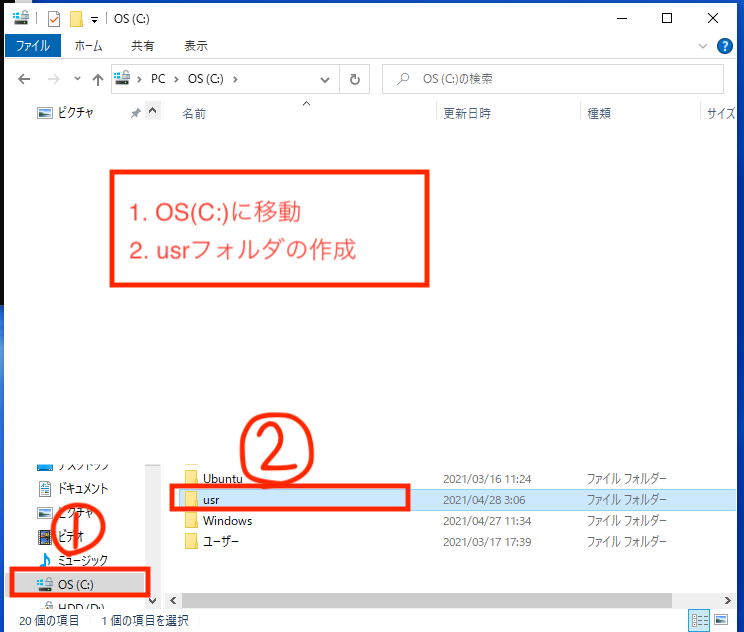
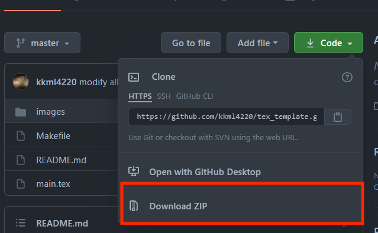
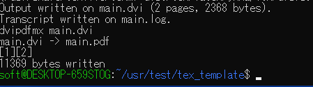
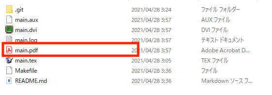

# [Windows] 最低限のTeX環境構築

[Qiitaの記事](https://qiita.com/kkml_4220/items/2bac5b83395d75619a0f)に紐づけられたリポジトリです.

## 目標

- TeX で最低限レポートが書ける程度に環境構築.

## 環境

- Windows10
- WSL Ubuntu 20.04LTS (Ubuntu 18.04LTS や他のバージョンでも可能)

## 準備

次のような手順で説明します.
すでに完了している事項は適宜スキップしてください.

1. WSL の有効化
1. `usr`フォルダの作成
1. テンプレートのダウンロード
1. usr フォルダへのリンクを作成
1. texlive のインストール

### 1.WSL の有効化

こちらの[記事](https://qiita.com/kkml_4220/items/f4fe903b36df8e4f7e24)を参考に WSL を有効化して Ubuntu をインストールしてください.

https://qiita.com/kkml_4220/items/f4fe903b36df8e4f7e24

### 2.usr フォルダの作成

Windows の`C:`ドライブの直下に`usr`フォルダを作成します.




### 3.テンプレートのダウンロード

[GitHub](https://github.com/kkml4220/template_tex)からzip形式でダウンロード.

https://github.com/kkml4220/template_tex



zip形式でタンロードしたものを先ほど作った`usr`フォルダにzipファイルを解凍したものを配置してください.

```bash
cd 
ls usr/
```

として,`template_tex-master`と表示されれば成功です.

### 4.usr フォルダへのリンクを作成

Windows のフォルダと Ubuntu のフォルダを紐付けます.
次のコマンドを順番に実行してください.

```bash
cd
ln -s /mnt/c/usr .
```

`ls`コマンドを実行して`usr`と表示されれば成功です.


### 5.texlive のインストール

はじめに`cd`コマンドで`Makefile`のあるディレクトリまで移動

`Ubuntu`で次のコマンドを実行してください.
結構時間がかかりますが気長に待ちましょう.

```bash
make install
```

途中で次のような入力を求められる場合があります.

- パスワードを聞かれる
  パスワードを入力して`Enter`
- インストールの続行の意思

```
Do you want to continue? [Y/n]
```

`y`と押して`Enter`キーを押してください.

以上で準備は終わりです.

次にコンパイル手順を説明します.

## コンパイル方法

1. `main.tex`が存在するディレクトリまで`cd`コマンドで移動します.
   - **注意** 特別な理由がない限り,基本的にファイル名を変更しないでください.
1. `ls`で`main.tex`の存在を確認する.
1. `make`と打ち込むと,エラーがなければ pdf ファイルが作成されます.

- コンパイルが成功した場合



のように表示され,Windows のフォルダを見てみると.


